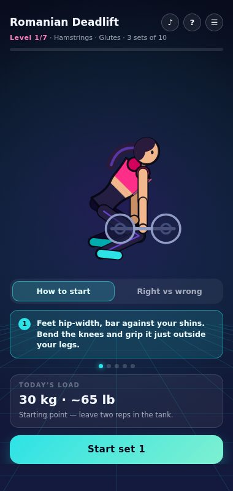
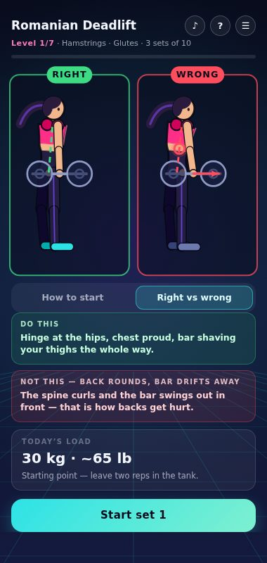
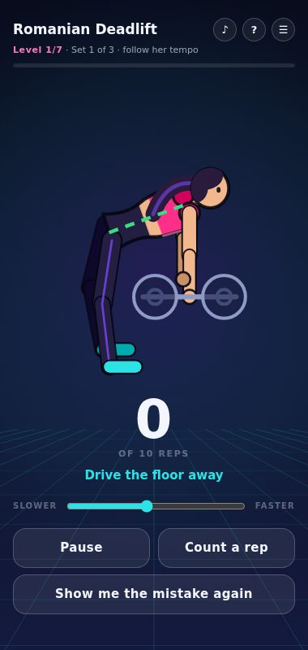
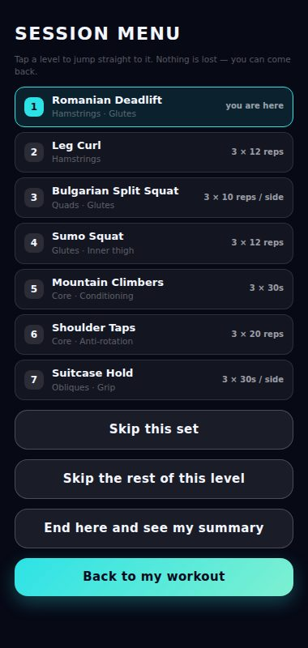

# Thursday Trainer — build summary

Your Thursday leg-and-core session as seven levels, with a coach drawn frame by
frame in code: she shows you how to pick the weight up, demonstrates the rep
beside the mistake that movement invites, and paces you through it.

| | |
|---|---|
| **Status** | Draft in your Plethora account — publishing stays manual |
| **Bit id** | `a662a8a2-6cc3-4a8d-ba81-00ffca5d3eb2` |
| **Package** | 81,022 bytes |
| **Runtime** | `plethora-bit@2` |
| **Contract** | `plethora-agent-context-2026-08-13.1` |
| **Branch / commit** | `claude/plethora-gym-trainer-3t0yar` @ `c192abd` |
| **Permissions** | `haptics`, `storage`, `backgroundMusic` — no camera, mic or motion |
| **Dependencies** | none |

---

## The session

Four for the legs, then three for the core. Each exercise is a level; clearing
its sets unlocks the next. A motivational line lands on every rest screen. The
whole thing runs about **44 minutes** including rest.

Every level demonstrates the specific fault that movement invites — not generic
advice, but the thing that actually goes wrong when you do it.

### 1. Romanian Deadlift · 3 × 10 · hamstrings, glutes
- **Not this** — the spine curls and the bar swings out in front. That is how backs get hurt.
- **Do this** — hinge at the hips, chest proud, bar shaving your thighs the whole way.

### 2. Leg Curl · 3 × 12 · hamstrings
- **Not this** — the hips peel off the pad and the low back arches to help. The hamstring stops working.
- **Do this** — hips pinned down, heels driven to your glutes, and a slow release.

### 3. Bulgarian Split Squat · 3 × 10 per side · quads, glutes
- **Not this** — the front knee shoots forward past the toes, the heel lifts and the chest folds over the thigh.
- **Do this** — front shin close to vertical, heel planted, chest tall as you sink straight down.

### 4. Sumo Squat · 3 × 12 · glutes, inner thigh
- **Not this** — the knees dive inward and the heels come off the floor, so the load leaves the glutes.
- **Do this** — knees pushed out over the toes, heels planted, hips straight down.

### 5. Mountain Climbers · 3 × 30s · core, conditioning
- **Not this** — the hips drop toward the floor (or shoot up), and the low back takes the whole load.
- **Do this** — one straight line from shoulders to heels. Plank first, then run.

### 6. Shoulder Taps · 3 × 20 · core, anti-rotation
- **Not this** — the hips swing with every tap. The whole point of the exercise leaks out of that swing.
- **Do this** — wide feet, still hips. Tap without letting anything else move.

### 7. Suitcase Hold · 3 × 30s per side · obliques, grip
- **Not this** — the body bends toward the load and the opposite hip juts out. Now it is a lean, not a carry.
- **Do this** — stand dead vertical. Ribs down, shoulders level, let the obliques fight the weight.

---

## How each level teaches

Every level opens on two tabs.

**How to start** — an animated walkthrough of getting into position, with the
captions highlighting in time with her. The first version dropped you straight
into reps, which left the obvious question unanswered: where does the weight
even start? For the Romanian deadlift it is now spelled out — you bend the knees
and deadlift it up first, *that* is the pickup and not the exercise, and then
every rep runs down from standing and back. You only lift it off the floor once.

**Right vs wrong** — the same body, twice, animating in sync. Green is correct
with its alignment guide drawn on her; red is the fault, with a pulsing marker on
the joint that is failing and an arrow showing which way it is going. During a
set it stays one tap away as a corner inset.

| How to start | Right vs wrong |
|---|---|
|  |  |
| Step 2 of 5, highlighting as she performs it. The load card sits under the captions. | Same rig, same tempo, framed identically so the difference is the only variable. |

| The set | Session menu |
|---|---|
|  |  |
| She sets the tempo; the slider and "count a rep" let you override it. | On every screen: jump to any level, skip a set, skip a level, or end early. |

---

## Weights

Before level 1 it asks how long you have been lifting and what you have
available today — full gym, dumbbells, or nothing — and suggests a working load
per exercise from that.

After every weighted set you tap how it felt: **easy**, **just right**,
**brutal**, or **had to stop**. That tap picks the next set's weight and
persists, so next Thursday opens with your numbers rather than a guess.

---

## Two constraints worth knowing

**No video, no images — at all.** Packaged assets are disabled in the runtime
(`maxAssets: 0`) and remote images are blocked, so a filmed trainer was never
available. She is drawn procedurally instead, which turned out to serve the
posture goal better: footage cannot hold the wrong position on demand or light
up the exact joint that is off.

**No spoken coaching.** There is no speech synthesis in the SDK — Bits get music
and sound effects, nothing that talks. Every cue is on screen, and the app says
so in its help sheet rather than leaving you wondering. Voice commands are out
for the same reason: the microphone exposes levels and spectrum, not words.

---

## What changed after you tried it

**Sound actually plays.** Playback was firing after an `await`, so the browser no
longer counted it as your tap and silently refused — mobile WebViews only allow
audio started from a user gesture. It now unlocks and starts inside the tap
handler. A ♪ button toggles it, and the help sheet reports the live audio state,
including `host_paused` (Plethora muting a backgrounded Bit).

**It starts at the beginning.** The *How to start* tab, on all seven levels.

**A plan up front.** A "Today's session" screen listing all seven levels with
sets, reps and the time estimate, before anything begins. Tap a row to jump.

**A menu you can escape into.** ☰ on every screen — jump to a level, skip a set,
skip the rest of a level, or end early. The finish recap now distinguishes
cleared, part-done and skipped levels.

---

## How she is drawn

The trainer is a 2D skeleton where every joint is an *absolute* angle, so a pose
is a plain table of numbers: 0° points straight down, +90° right. That makes each
exercise a short keyframe track, and one rig covers everything — a correct
variant, a fault variant and a setup walkthrough for each of the seven
movements, plus an idle and a celebration (21 tracks).

The framing is computed, not hand-placed: both variants are sampled to fit the
figure identically in the right and wrong panels, so the two are genuinely
comparable, and the plank floor line is pinned to the height of her planted
hands. The alignment guides — spine, hip line, knee-over-foot, plank, plumb —
are drawn per movement from the same skeleton.

Fonts come from the Plethora registry; everything else is procedural.

---

## Getting it uploaded — for the record

The draft validator rejected the second build with *"this bit uses unsupported
remote resources"*, which was misleading because there are none. Two separate
causes:

1. An argument to `ctx.music.play()` was a member expression
   (`wantPreset.tempo`) where the validator wants a literal or a plain local.
   Loader-style arguments have to stay simple.
2. **Source size.** The identical code passes at 78 KB and fails above ~90 KB.
   Confirmed by padding a known-good file with comments until it failed — and a
   later attempt returned `Request deadline exceeded`, which says the generic
   error was a timeout wearing a bad label.

Hence `dev/build.py`, which strips comments and collapses indentation — nothing
else — before upload. The source in the repo stays readable at 93 KB; the
uploaded artifact is 78 KB.

---

## Files

Everything is in `plethora-thursday-trainer/`:

| Path | What it is |
|---|---|
| `main.js` | the Bit — readable source |
| `plethora.json` | the manifest |
| `dev/build.py` | `main.js` → `build/main.js`, the upload artifact |
| `dev/harness.html` | mocks the whole `ctx` surface and drives the frame loop by hand |
| `dev/shoot.mjs` | walks a full session, screenshots every level (`BUILT=1` targets the build) |
| `dev/posegrid.mjs` | renders every pose of every exercise as one contact sheet |
| `docs/screens/` | the screenshots in this file |

That tooling is how the figure got debugged. It caught things worth catching —
the head was being attached below the neck at every angle, and her
mountain-climber knee was driving into the floor instead of toward her chest.

The last verification run walked all seven levels end to end against the built
artifact: progress 1.0, `complete` fired, no page errors.

---

## Note

The Bit is a **draft** in your Plethora account — open Plethora → Create to try
it. Publishing stays manual and is yours to do after you have run a session
with it.

Weight suggestions are a conservative starting point, **not coaching or medical
advice**. The app says so on its first screen and in its help sheet. Form and how
you feel override the number; stop any rep that hurts.
